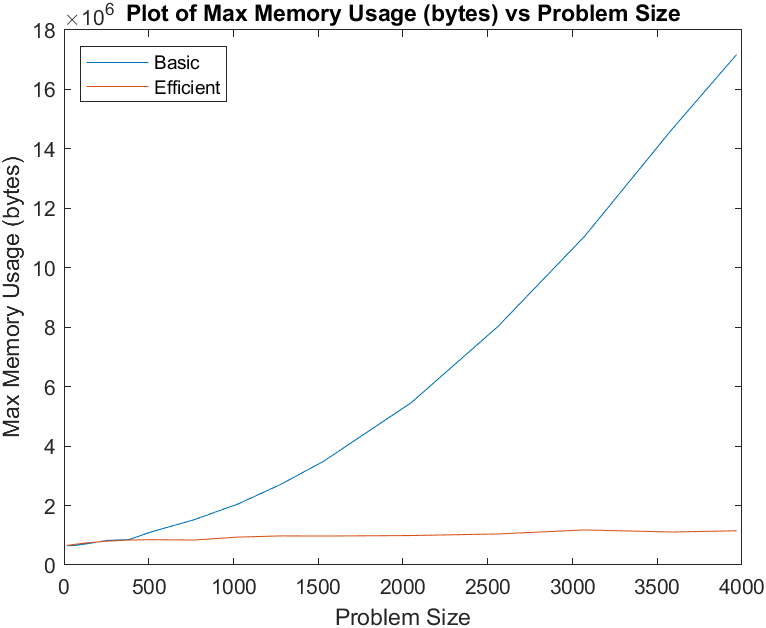
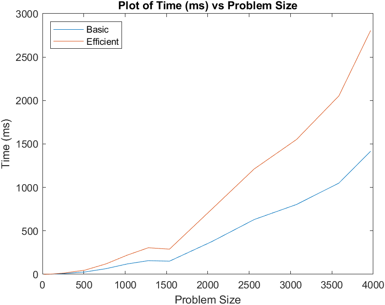

# Sequence Alignment Problem

## Basic Build Instructions
From the project root, execute `./basic.sh <input_file_path> <output_file_path>` or `./efficient.sh <input_file_path> <output_file_path>` to perform a clean build and run the program.

## Comprehensive Build Instructions
1. Clone this repo.
2. Make a build directory in the top level directory: `mkdir build && cd build`
3. Compile: `cmake .. && make`
4. Run it: `./<basic | efficient>.sh <input_file_path> <'basic' | 'efficient'>`

## Results

### Datapoints

Problem Size (M + N) | Time in MS (Basic) | Time in MS (Efficient) | Memory in KB (Basic) | Memory in KB (Efficient)
------------- | ------------- | ------------- | ------------- | -------------
16 | 0.148	| 0.17 | 636 | 640
64 | 0.67 | 1.276 | 640 | 680
128 | 2.149	| 4.035	| 692 | 724
256 | 7.365	| 13.781 | 808 | 784
384 | 18.157 | 31.097 | 836 | 820
512 | 26.397 | 47.512 | 1084| 832
768 | 64.725 | 119.988 | 1488 | 820
1024 | 119.103 | 220.16 | 2000 | 916
1280 | 157.136	| 305.637	| 2652 | 956
1536 | 151.143 |	289.596	| 3424 | 952
2048 | 376.547 |	750.159 | 5332 | 968
2560 | 630.382	| 1212.42	| 7836 | 1020
3072 | 803.78 | 1551.7 | 10804	| 1152
3584 | 1049.88 | 2053.37	| 14296	| 1084
3968 | 1416.22	| 2806.62 | 16772	| 1124

### Graph 1 – Memory vs Problem Size (M+N)

### Graph 2 – Time vs Problem Size (M+N)

