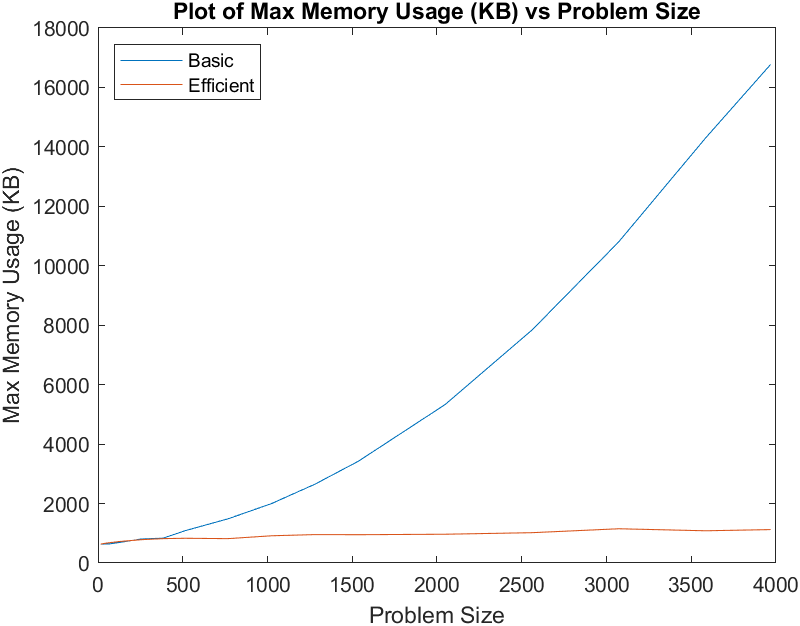

# CSCI 571 Project: Sequence Alignment Problem

## Basic Build Instructions
From the project root, execute `./basic.sh <input_file_path>` or `./efficient.sh <input_file_path>` to perform a clean build and run the program.

## Comprehensive Build Instructions
1. Clone this repo.
2. Make a build directory in the top level directory: `mkdir build && cd build`
3. Compile: `cmake .. && make`
4. Run it: `./seq <input_file_path> <'basic' | 'efficient'>`

## Results

### Graph 1 – Memory vs Problem Size (M+N)

### Graph 2 – Time vs Problem Size (M+N)

